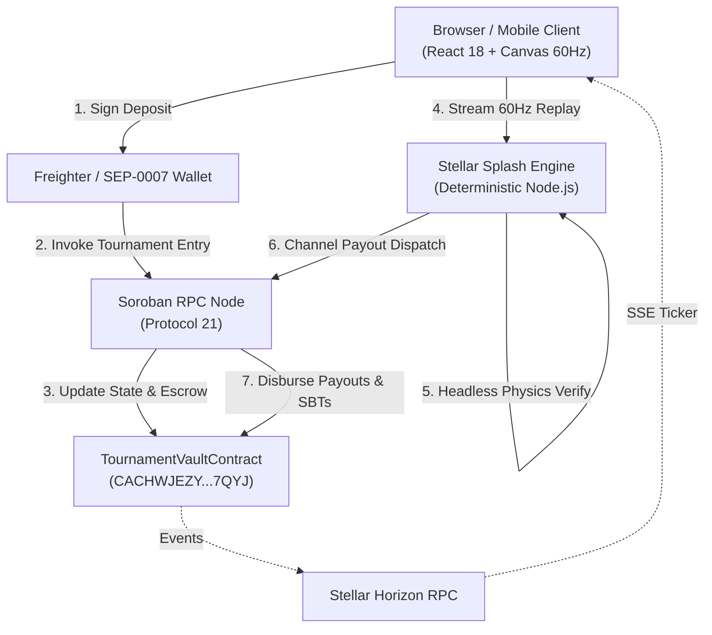
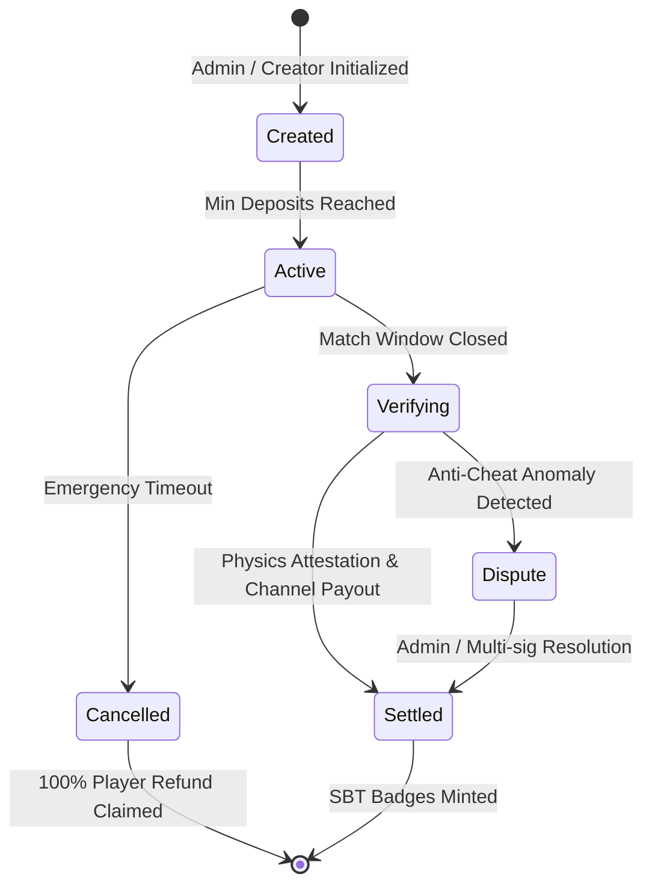

# Stellar Splash - Ecosystem Architecture Diagrams

## 1. System Topology Diagram

```mermaid
graph TD
    Client["Browser / Mobile Client<br/>(React 18 + Canvas 60Hz)"]
    Freighter["Freighter / SEP-0007 Wallet"]
    Engine["Stellar Splash Engine<br/>(Deterministic Node.js)"]
    Horizon["Stellar Horizon RPC"]
    SorobanRPC["Soroban RPC Node<br/>(Protocol 21)"]
    Contract["TournamentVaultContract<br/>(CACHWJEZY...7QYJ)"]

    Client -->|1. Sign Deposit| Freighter
    Freighter -->|2. Invoke Tournament Entry| SorobanRPC
    SorobanRPC -->|3. Update State & Escrow| Contract

    Client -->|4. Stream 60Hz Replay| Engine
    Engine -->|5. Headless Physics Verify| Engine
    Engine -->|6. Channel Payout Dispatch| SorobanRPC
    SorobanRPC -->|7. Disburse Payouts & SBTs| Contract

    Contract -.->|Events| Horizon
    Horizon -.->|SSE Ticker| Client
```

## 2. Tournament State Machine Flow

```mermaid
stateDiagram-v2
    [*] --> Created : Admin / Creator Initialized
    Created --> Active : Min Deposits Reached
    Active --> Verifying : Match Window Closed
    Verifying --> Settled : Physics Attestation & Channel Payout
    Verifying --> Dispute : Anti-Cheat Anomaly Detected
    Dispute --> Settled : Admin / Multi-sig Resolution
    Active --> Cancelled : Emergency Timeout
    Cancelled --> [*] : 100% Player Refund Claimed
    Settled --> [*] : SBT Badges Minted
```

